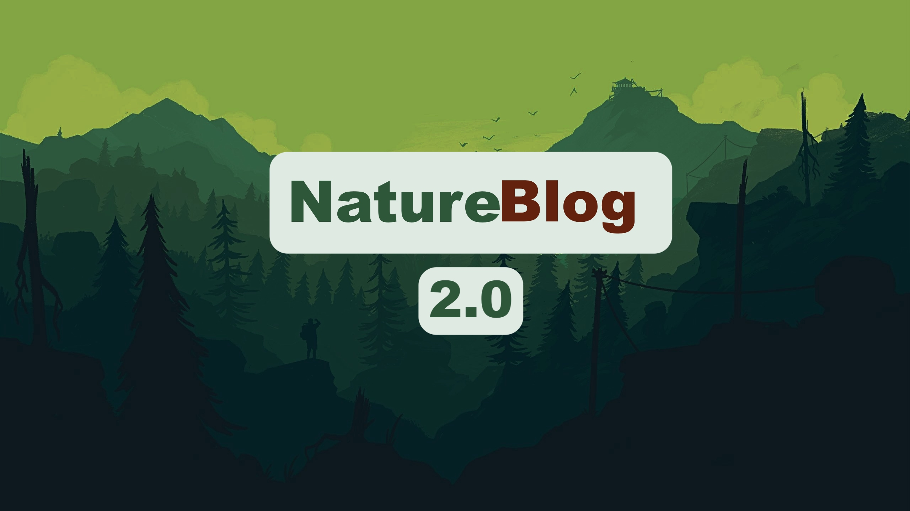

# NatureBlog 2.0 - Django Blog Application

This is a Blog Web Application, written in <strong>Django 3</strong>. 

<strong>This application allows the creation and publication of posts</strong>. The posts are listed in the main layout, and it's possible to see the Title, the Published Date, and a small part of their Text Content. By clicking on the Post's Link you are interested in, you can see all of its content.



 ## Table Of Contents

 * [General Info](https://github.com/GloriaX21/Django_Blog-1.0/tree/dev-features#general-info)
 * [Technologies](https://github.com/GloriaX21/Django_Blog-1.0/tree/dev-features#technologies-used)
 * [Setup](https://github.com/GloriaX21/Django_Blog-1.0/tree/dev-features#setup)
 * [Status](https://github.com/GloriaX21/Django_Blog-1.0/tree/dev-features#status)
 
 ## General Info
 
 This Blog Application 2.0 has new extra features that the previous version 1.0 (You can check the code of the old one 
 in this repository: [NatureBlog1.0](https://github.com/GloriaX21/Django_Blog-1.0))

 Extra features:

 * Sharing posts via email
 * Adding comments to a post
 * Tagging posts
 * Recommending similar posts 


This is the <strong>Comment Model</strong> code:
```python
class Comment(models.Model):
    post = models.ForeignKey(Post,
                            on_delete=models.CASCADE,
                            related_name = 'comments')
    name = models.CharField(max_length=80)
    email = models.EmailField()
    body = models.TextField()
    created = models.DateTimeField(auto_now_add=True)
    updated = models.DateTimeField(auto_now=True)
    active = models.BooleanField(default=True)

    class Meta:
        ordering = ('created',)

    def __str__(self):
        return f'Comment by {self.name} on {self.post}'
```

This is the code of the two <strong>Forms</strong> in the <strong>forms.py</strong> file:
```python
from django import forms
from .models import Comment

class EmailPostForm(forms.Form):
    name = forms.CharField(max_length=25)
    email = forms.EmailField()
    to = forms.EmailField()
    comments = forms.CharField(required=False, widget=forms.Textarea)


class CommentForm(forms.ModelForm):
    class Meta:
        model = Comment
        fields = ('name', 'email', 'body')
```


 ## Technologies Used

  ### Languages Used

  * [Python3](https://en.wikipedia.org/wiki/Python_(programming_language))
  * [HTML5](https://en.wikipedia.org/wiki/HTML5)
  * [CSS3](https://en.wikipedia.org/wiki/CSS#CSS_3)
  * [SQLite](https://en.wikipedia.org/wiki/SQLite)

  ### Frameworks, Libraries & Programs Used

  1. [Django3](https://en.wikipedia.org/wiki/Django_(web_framework))
  2. [SASS](https://en.wikipedia.org/wiki/Sass_(stylesheet_language))
  3. [Google Fonts](https://en.wikipedia.org/wiki/Google_Fonts)
  4. [Git](https://en.wikipedia.org/wiki/Git)
  5. [GitHub](https://en.wikipedia.org/wiki/GitHub)


 ## Setup

  To run this project on your machine you should use a <strong>Virtual Environment</strong> with <strong>Django3</strong> installed. It's necessary to have also <strong>Python3</strong> installed.

  It's recommended to follow the instructions below:
  
  ### Check Python Version/Install Python3

  1. Check if you have <strong>Python3</strong> installed. Open the Terminal and type:
  ```bash
  python3
  ```

  You should get an output that shows you the Python version installed on your OS. In case you don't get anything, checks this guide to install the last version of Python3 [Python.org/downloads](https://www.python.org/downloads/)

  ### Install the Virtual Enviroment

  1. After you installed Python3. Create an empty folder in your machine:
  ```bash
  mkdir django_projects
  ```

  2. Go inside the folder and install the <strong>Virtual Environment</strong>:
  ```bash
  python3 -m venv my_env
  ```  

  3. Activate the <strong>Vitual Enviroment</strong>:
  ```bash
  source my_env/bin/activate
  ``` 
  Whenever you would like to <strog>deactivate</strog> the <strong>Virtual Environment</strong>, type:
  ```bash
  source my_env/bin/deactivate
  ``` 

  ### Install Django3 Framework in the Virtual Environment with pip

  (With Python3, <strong>pip</strong> package manager comes installed. It's recommended to use <strong>pip3</strong>)

  1. Install <strong>Django3</strong>:
  ```bash
  pip3 install "Django==3.0.*"
  ```  

  2. <strong>Check that Django3 it's been successfully installed</strong>:
  ```bash
  python3
  >>> import django
  >>> django.get_version()
  '3.0.14'
  ``` 
  
  ### Install "django-taggit" application with pip, to use tags

  ```bash
  pip install django_taggit==1.2.0
  ```

  ### Run the Application on the Server

  1. Download the NatureBlog Project's Folder from this GitHub Account;
  2. Put this folder inside the Remote Django Projects folder in you machine (where you installed the Virtual Environment);
  3. Be sure that the Virtual Environment is active (you should see <strong>(my_env)</strong> next to your bash username on the Terminal);
  4. <strong>Follow these steps to run the project on the Server</strong>:

     1. Go inside <strong>the nature_project folder</strong>:
     ```bash
     cd nature project
     README.md blog db.sqlite3 images manage.py nature 
     ```

     2. Run the Server with Django <strong>runserver</strong> command
     ```bash
     Watching for file changes with StatReloader
     ``` 

     ```bash
     System check identified no issues (0 silenced).
     February 19, 2022 - 12:20:00
     Django version 3.0.14, using settings 'nature.settings'
     Starting development server at http://127.0.0.1:8000/
     Quit the server with CONTROL-C.
     ```

     3. Copy the <strong>URL address</strong> you'll obtain on your Browser's navbar, adding the <strong>blog/</strong> path:

     


  ### Status

  A new version of this application (NatureBlog 3.0) is under development. 
  This new version will include extra functionalities, like:

  * Creating custom template tags and filters
  * Adding a sitemap and post feed
  * Implementing full-text search with PostgreSQL


